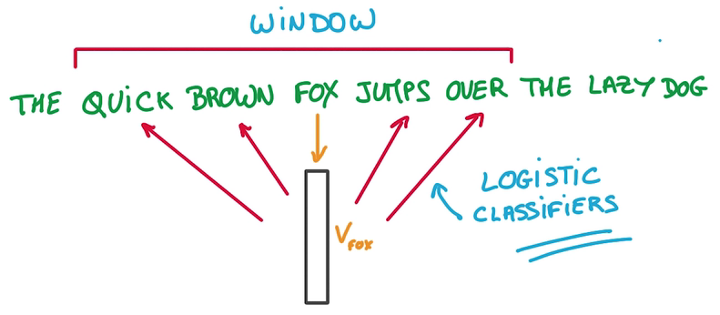
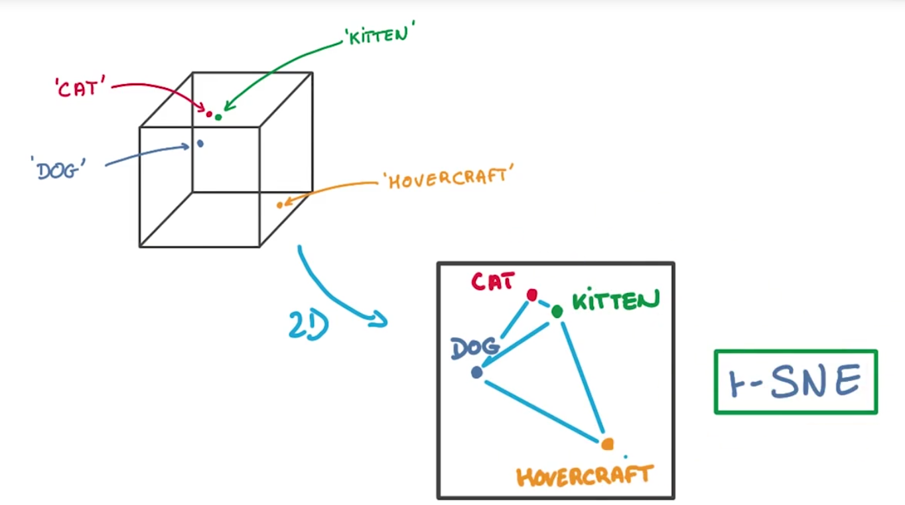
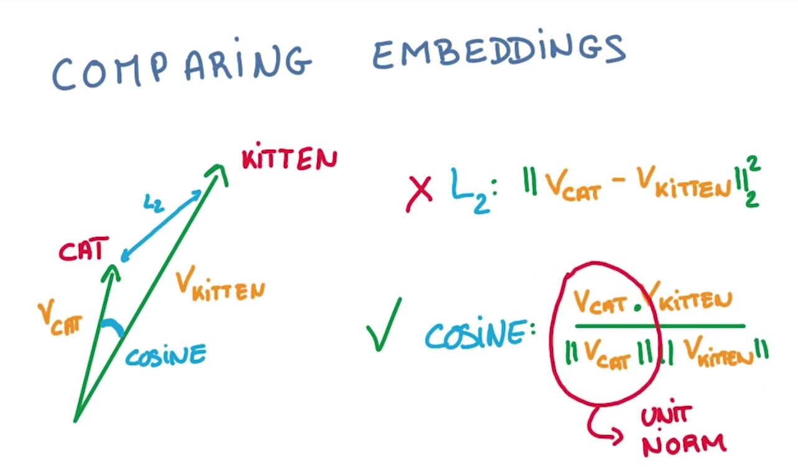
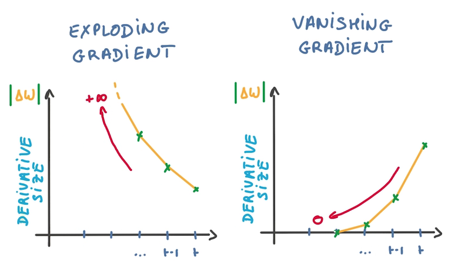
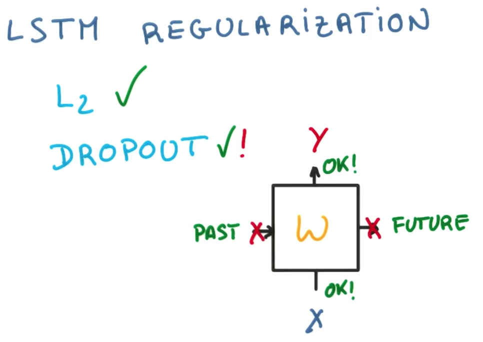
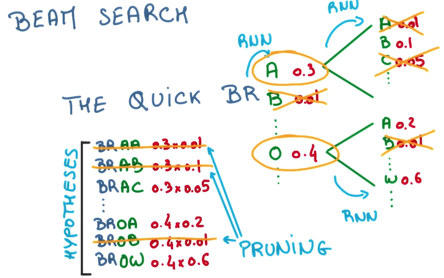
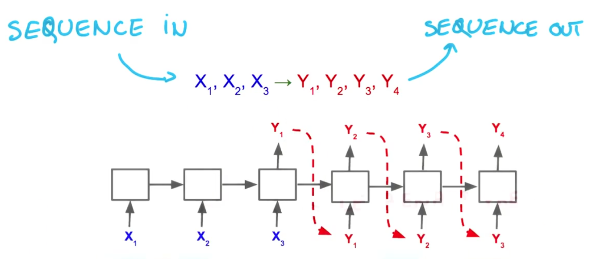
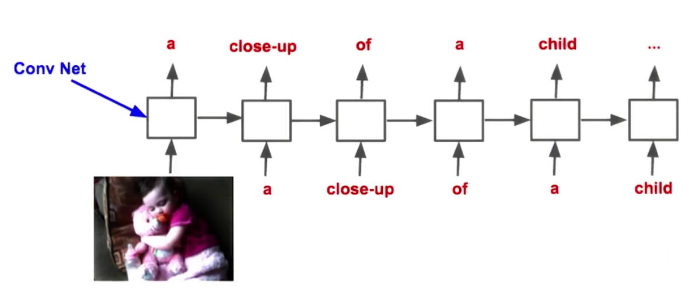

# Udacity
- Udacity深度学习课程[地址](https://www.udacity.com/course/deep-learning--ud730)
- [GitHub](https://github.com/tensorflow/tensorflow/tree/master/tensorflow/examples/udacity)

## Deep Models for Text and Sequence

### 文本
- 文本分析中，越不常见的词往往越重要，例如出现“retinopathy”（视网膜病）很可能是医学文献
- 相似的词汇往往出现在相似的场景（similar contexts）中
- Word2Vec是一种Embeddings的方法，越相似的单词的向量会越接近

  - 将每个词映射到一个Vector列表(就是一个Embeddings)里，一开始随机，用这个Embedding进行预测
  - 目标是让Window里相近的词放在相邻的位置，即预测一个词的邻居
- 如果用PCA将Embeddings维度降维二维，将会损失大量信息，而tSNE能保持近邻数据结构

- 比较两个vector之间的夹角大小来判断接近程度，用cos值而非L2计算，因为vector的长度和分类是不相关的。最好将要计算的vector都归一化

### 序列
- 文本（Text）是单词（word）的序列，一个关键特点是长度可变，就不能直接变为vector

- 梯度爆炸/梯度消失（Exploding Gradient/Vanishing Gradient）

  - Gradient Clipping可简单又有效的缓解梯度爆炸，通过设置最大值
- LSTM的出现很好的解决的梯度消失的问题

  - 对于LSTM的正则好，一般的L2可以实现，更好的做法是使用Dropout层，但只在输入以及输出Dropout
  
- Beam Search
  - 每次只预测序列的下一个点is greed, 可以预测多步，然后挑选整体概率最高的。而由此导致的问题是候选序列过多，Beam Search就是挑选概率较高的候选点。
  
- RNN的应用
  - 将可变长度的vector变成固定长度
  - 将固定长度的vector变成可变长度
  - 将可变长度的vector变成可变长度，Sequence in Sequence out
  
  - 翻译：输入英语单词序列，输出法语单词序列
  - 语音识别：输入语音序列，输出文字
  - 自动生成图片描述：CNN+RNN
  
  